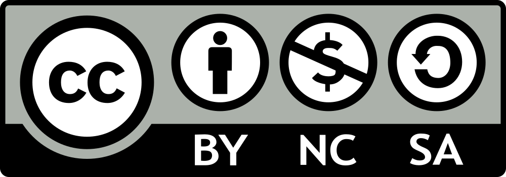

# Semantic and Relational Spaces in Science of Science: Deep Learning Models for Article Vectorisation


## Repository structure

This is the repository for the article "Semantic and Relational Spaces in Science of Science: Deep Learning Models for Article Vectorisation" and contains the following elements:

- data: Articles ID's and embeddings, and
- code: All the necesary code to reproduce the results presented in the article.


## Dataset description

This repository contains the DOI for 22,151 articles from 16 Journals in the Science of science field. The following table shows a summary of the dataset statistics


| **Field**                                                   | **Journal**                                  | **Articles Retrived** | **Mean Citations** | **Max Citations** | **First~Year** | **Last Year** |
|-------------------------------------------------------------|----------------------------------------------|----------------------:|-------------------:|------------------:|---------------:|--------------:|
| Management                                                  | Research Policy                              |             3,221  	 |      83.75 		  | 4,820 			  | 1971		   | 2020		   |
| Management                                                  | Science and Public Policy                    |             1,707  	 |      13.27 		  |   462 			  | 1976		   | 2019		   |
| Library and Information Sciences                            | Scientometrics                               |             5,136  	 |      20.04 		  | 1,334 			  | 1978		   | 2020		   |
| Library and Information Sciences                            | Journal of Informetrics                      |               876  	 |      22.63 		  |   352 			  | 2007		   | 2020		   |
| History and Philosophy                                      | Synthese                                     |             4,151  	 |       8.53 		  |   910 			  | 1946		   | 2020		   |
| History and Philosophy						              | Social Studies of Science                    |             1,069  	 |      40.95 		  | 4,709 			  | 1971		   | 2020		   |
| History and Philosophy						              | Science and Education                        |             1,034  	 |      11.60 		  |   298 			  | 1992		   | 2020		   |
| History and Philosophy						              | Studies in History and Philosophy of Science |               911  	 |       8.76 		  |   145 			  | 1974		   | 2020		   |
| History and Philosophy						              | Isis                                         |               523  	 |      12.47 		  |   415 			  | 1977		   | 2020		   |
| History and Philosophy						              | Science, Technology and Society              |               345  	 |       6.07 		  |   122 			  | 1996		   | 2020		   |
| History and Philosophy						              | British Journal For the History of Science   |               276  	 |       9.57 		  |    88 			  | 1962		   | 2020		   |
| History and Philosophy						              | Science and Technology Studies               |               111  	 |       5.29 		  |    39 			  | 2012		   | 2019		   |
| Social Sciences: Education, Communication and Anthropology  | Public Understanding of Science              |               977  	 |      25.91 		  |   518 			  | 1996		   | 2020		   |
| Social Sciences: Education, Communication and Anthropology  | Science, Technology and Human Values         |               757  	 |      32.87 		  |   828 			  | 1982		   | 2020		   |
| Social Sciences: Education, Communication and Anthropology  | Research Evaluation                          |               666  	 |      13.15 		  |   223 			  | 1991		   | 2019		   |
| Social Sciences: Education, Communication and Anthropology  | Minerva                                      |               391  	 |      16.51 		  |   624 			  | 1965		   | 2020		   |
|                                                             | **Total**                                    |            22,151  	 |      20.71 		  | 4,820 			  | 1946		   | 2020		   |


The DOI's can be used to extract the full metadata of articles with Scopus API, following [code/dataset/1_data_retrival.ipynb](code/1_dataset/1_data_retrival.ipynb).


This repository also contains 2 Embeddings based on the dataset using BERT and GCN-GAE. The embedding representation and DOI's are in the same order in both files. 


## code

the code is divided into three steps:

1. dataset
2. models
3. ablation study


The great part of the code was implemented as libraries under the libs/ folder. Each section contains one of such folder, and several sorted Jupyter Notebooks that implement some specific step using the .py files in libs/ 

In order to reproduce the results, the scripts should be run in the order described by the folders and files. In order to retrieve the dataset from Scopus, the user must have the proper API Keys. The original dataset can be send prior written authorisation from Scopus. 


## Reference

More information about the dataset and the guidelines can be found in the following article:


Diego Kozlowski, Jennifer Dusdal, Jun Pang, Andreas Zilian (2021). Semantic and Relational Spaces in Science of Science: Deep Learning Models for Article Vectorisation


If you use any of the provided material in your work, please cite us as follows


```
@article{Kozlowski-et-al,
title = "Semantic and Relational Spaces in Science of Science: Deep Learning Models for Article Vectorisation",
journal = "?",
volume = "?",
number = "?",
year = "?",
issn = "?",
doi = "?",
url = "?",
author = "Diego Kozlowski and Jennifer Dusdal and Jun Pang and Andreas Zilian",
keywords = "Embeddings, Science of Science, Deep Learning, Graph Neural Networks, Semantic Space, Relational Space",
}

```


### Licence



This work is licensed under a [Creative Commons Attribution-NonCommercial-ShareAlike 4.0 International License](https://creativecommons.org/licenses/by-nc-sa/4.0/). 

### Contact information
If you have any question or suggestion, do not hesitate to contact us at the following address:
- Diego Kozlowski ([diego DOT kozlowski AT uni DOT lu](mailto:diego.kozlowski@uni.lu))


